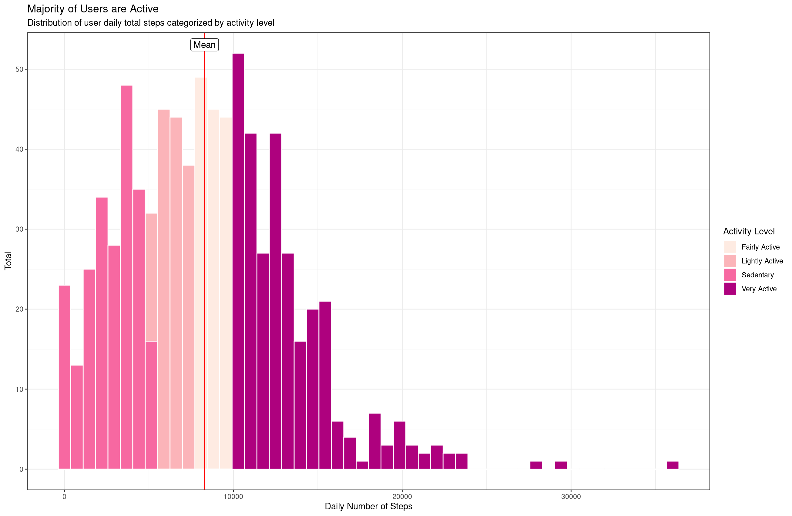

# Bellabeat Wellness Tracker Analysis

## Description

<p align="center">
  
</p>

### Company Profile 

Bellabeat is tech-driven wellness company for women which potentially become a larger player in health-focused smart products market. 
Founded in 2013, Bellabeat has grown rapidly and quickly positioned itself as a tech-driven wellness company for women. 
By 2016, Bellabeat had opened offices around the world and launched multiple products. 
Bellabeat products became available through a growing number of online retailers in addition to their own e-commerce channel on their website.

### Product Portfolio

1. **Bellabeat app**: The Bellabeat app provides users with health data related to their activity, sleep, stress, menstrual cycle, and mindfulness habits. 
	This data can help users better understand their current habits and make healthy decisions. 
	The Bellabeat app connects to their line of smart wellness products.
2. **Leaf**: Bellabeat’s classic wellness tracker can be worn as a bracelet, necklace, or clip. The Leaf tracker connects to the Bellabeat app to track activity, sleep, and stress.
3. **Time**: This wellness watch combines the timeless look of a classic timepiece with smart technology to track user activity, sleep, and stress.
	The Time watch connects to the Bellabeat app to provide you with insights into your daily wellness.
4. **Spring**: This is a water bottle that tracks daily water intake using smart technology to ensure that you are appropriately hydrated throughout the day. 
	The Spring bottle connects to the Bellabeat app to track your hydration levels.
5. **Bellabeat membership**: Bellabeat also offers a subscription-based membership program for users. Membership gives users 24/7 access to fully 
	personalized guidance on nutrition, activity, sleep, health and beauty, and mindfulness based on their lifestyle and goals.


## Business Problem

```
Discover growth opportunities for Bellabeat company by identifying smart device usage data 
in order to gain insight into how consumers use non-Bellabeat smart devices.
```

## Data

### Data Source

The data source is fitness tracker data for a thirty one day time period from thirty three users using a competitor’s product Fitbit. The data was collected by a survey sent via Amazon Mechanical Turk between 03.12.2016-05.12.2016. CC0: Public Domain, made available by Möbius. It was last updated over a year ago.

Link to the dataset : [FitBit Fitness Tracker Data](https://www.kaggle.com/datasets/arashnic/fitbit)

### Data Cleaning

1. **Completeness**

Steps data: 33 unique users (100%)
Sleep data: 24 unique users (73%)
Weight data: 8 unique users (24%)

2. **Integrity**

- Variable names and file names changed to standard formats
- Id fields converted to factors
- Date and Time fields converted from character strings to datetime formats


## Analysis

### Activity

User daily activity level will be categorized into 4 groups as per the [10,000-step](https://www.10000steps.org.au/articles/counting-steps/#:~:text=Low%20active%20is%205%2C000%20to,active%20is%20more%20than%2012%2C500) standard. The daily steps of each user each day will intepreting their activity level. 
The categories are as follow:
**Sedentary** - Less than 5000 steps per day
**Lightly active** - Between 5000 and 7499 steps per day
**Fairly active** - Between 7500 and 9999 steps per day
**Very active** - More than 10000 steps per day

<details><summary><b>Show Code</b></summary>

```R
ggplot(trimmed_activity, aes(x = total_steps, fill = activity_level)) +
  geom_histogram(bins= 50, position = "identity", colour="white") +
  geom_vline(xintercept = Mean.TotalSteps, color = "red")+
  theme_bw()+
  labs(x = "Daily Number of Steps", y = "Total",
       title = "Majority of Users are Active",
       subtitle = "Distribution of user daily total steps categorized by activity level")+
  guides(fill = guide_legend(title = "Activity Level"),
         colour = guide_legend(title = "Activity Level"))+
  annotate(x = Mean.TotalSteps, y =+Inf, label = "Mean", vjust = 1.5, geom = "label")+
  scale_fill_brewer(palette = "RdPu")
```
</details>

<p align="center">
  
</p>

Majority of user are in either the Fairly Active to Very active category. This findings could help see the potential target consumer.

### Sleep